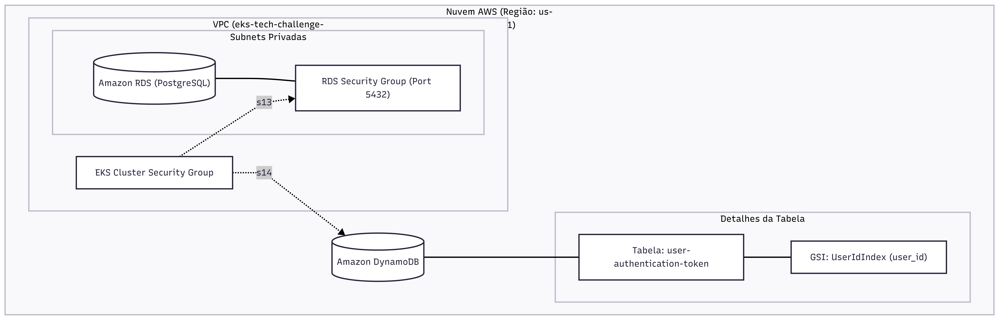

# IaC Tech Challenge - Data Layer

Este repositório contém a Infraestrutura como Código (IaC) responsável por provisionar a camada de dados do projeto. Ele configura os bancos de dados necessários, como o Amazon RDS (PostgreSQL) para dados relacionais e o Amazon DynamoDB para armazenamento de tokens de autenticação de usuários, suportando tanto ambientes AWS reais quanto desenvolvimento local via LocalStack.

## 🛠 Tecnologias Utilizadas

- Terraform (v1.0+)
- AWS CLI & AWS Provider
- LocalStack (para desenvolvimento e testes locais)
- Amazon RDS (PostgreSQL)
- Amazon DynamoDB

## 🚀 Passos para Execução e Deploy

### 1. Pré-requisitos
Certifique-se de ter instalado em sua máquina:
- [Terraform](https://developer.hashicorp.com/terraform/downloads)
- [AWS CLI](https://aws.amazon.com/cli/)
- [LocalStack](https://localstack.cloud/) (apenas para execução local)

### 2. Execução Local (com LocalStack)
Para testar a infraestrutura localmente sem gerar custos na AWS, siga os passos abaixo:

1. Inicie o LocalStack em segundo plano:
   ```bash
   localstack start -d
   ```
2. Acesse o diretório da configuração local:
   ```bash
   cd localstack
   ```
3. Inicialize o Terraform e aplique a infraestrutura:
   ```bash
   terraform init
   terraform apply
   ```

### 3. Deploy na AWS (Ambiente Real)
Para provisionar os recursos diretamente na AWS (configurado para roles do AWS Academy/Lab):

1. Configure suas credenciais da AWS utilizando o AWS CLI.
2. Acesse o diretório da configuração AWS:
   ```bash
   cd aws
   ```
3. Inicialize o Terraform e aplique as configurações:
   ```bash
   terraform init
   terraform apply
   ```

*Nota: A infraestrutura de dados depende de uma rede existente (VPC e Subnets). O RDS é provisionado em subnets privadas, e o DynamoDB possui um Global Secondary Index configurado. O estado do Terraform é gerenciado via S3.*

## 📐 Diagrama da Arquitetura



## 📄 APIs (Swagger/Postman)

- **Link para a documentação/collection:** *(em branco)*
